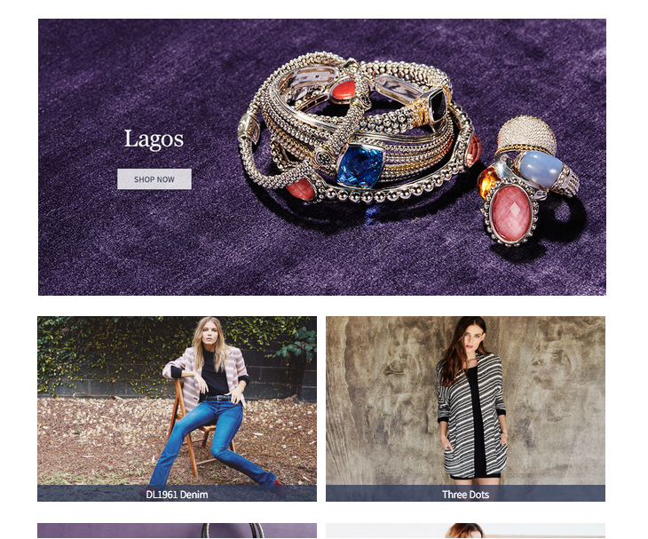
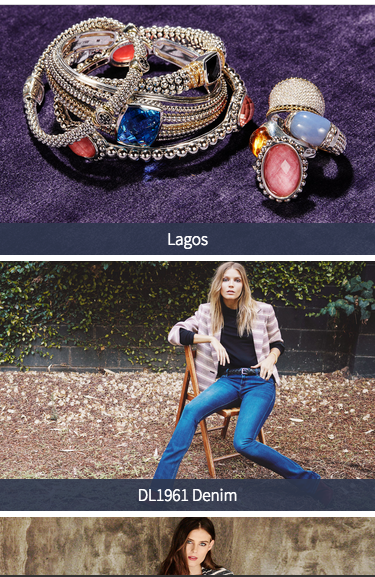

# HauteLook React Test

Instructions for the HauteLook Web Engineer React Test

## Requirements

   * node - `0.12.7` or higher
   * npm - `2.12.1` or higher

## Installation

   * Make sure you have a working internet connection. You will need npm to download dependencies.
   * Install dependencies using `npm install`

Note: We expect installation to take less than 5 minutes to setup. If for any reason it is taking longer, please feel free to reach out to us. We are happy to [help](#support).

## Running The Server

After installation, start the node server by running: `npm start`

The server should start on port 3000 without errors. If port 3000 is already taken, you can set a custom port: `PORT=3001 npm start`

You should be able to see the index page with some basic html output. This also means React is working within the browser.

## Code Layout

Here is a high level overview of the important files in this project:

   * `server.js` - The express server
   * `public/index.html` - The page to display all the events
   * `public/design.html` - Design comp information

## Challenge

Use the production HauteLook Events API to list all the events in a grid format. Go to the index web page for detailed instructions. You are free to use whatever JS/CSS packages, libraries, tools and frameworks to complete the task. However, you must use React to render the markup into the DOM. You will be judged on the quality of code, the use of React and the look of the webpage on both a laptop and a mobile device. You do not need to minify or compress the JS or CSS. However, you are encouraged to organize your JS and CSS in a way you think is best for someone to review the code.

### Instructions

Here are the design instructions for both **Desktop** and **Mobile** web pages. The design should be responsive to the different form factors.

#### Desktop

Reference device is a 15" laptop screen (no retina) using Chrome.

   * The grid of events should start 48px from the top of the webpage
   * The first event will be a large image. Use the `http://hautelook.com/rels/images/event-hero` link relation in the json response. Note: the first image has the title burned into the image.
   * All subsequent images be side by side. Use the `http://hautelook.com/rels/images/event-square` link relation in the json response.
   * Each row has 36px of whitespace beneath it.
   * The smaller, side by side, images have 16px of whitespace.
   * The event title is Arial 18px, color #fff
   * The rectangle border at the bttom of the smaller images is rgb(44,56,87) with 75% opacity
   * If there are an odd number of events, show the last image on the left side and leave the right side blank.

You can use this example image for reference:

#### Mobile

Reference device is a iPhone 6 (emulated).

   * The grid of events should start 16px from the top of the webpage
   * There should be one image per row. Use the `http://hautelook.com/rels/images/event-main` link relation in the json response. The image should take up the entire width of the screen.
   * Each row has 8px of whitespace beneath it.
   * The event title is Arial 18px, color #fff
   * The rectangle border at the bttom of the smaller images is rgb(44,56,87) with 75% opacity
   * If there are an odd number of events, show the last image on the left side and leave the right side blank.

You can use this example image for reference:

### Support

Need help? Please reach out to us! We know computers can be tricky things and we are happy to assist you. Our contact details are in the email we sent you. We will get back to you as soon as we can.

